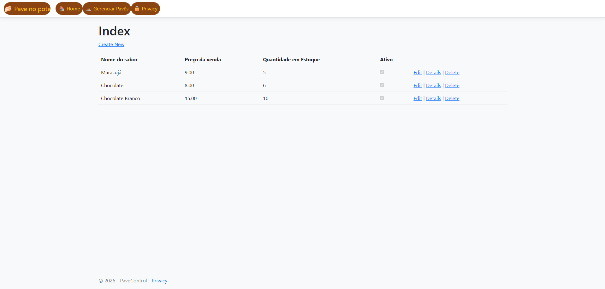

# 🍮 PaveControl - Sistema de Gestão de Pavês


O **PaveControl** é uma aplicação web completa desenvolvida para o gerenciamento de inventário e vendas de pavês artesanais. O projeto foi desenhado seguindo as melhores práticas da arquitetura MVC, com foco em escalabilidade e deploy em nuvem.




---

## 🚀 Status do Projeto: Em Produção
A aplicação está hospedada na Azure e pode ser acessada em:  
🔗 [https://pavecontrol-iclas.azurewebsites.net/](https://pavecontrol-iclas-bec0fndshxh5byak.canadacentral-01.azurewebsites.net/) 

---

## 🛠 Tecnologias e Ferramentas

* **Backend:** C# com ASP.NET Core MVC.
* **ORM:** Entity Framework Core (Code First).
* **Banco de Dados:** Azure SQL Database.
* **Frontend:** Razor Pages, HTML5, CSS3, Bootstrap e JavaScript.
* **Infraestrutura/Cloud:** * **Azure App Service** para hospedagem da aplicação.
    * **Managed Identity** para autenticação segura entre serviços (sem senhas expostas).
    * **Azure SQL Server** para persistência de dados.

---

## 🏗 Arquitetura e Funcionalidades

O projeto implementa um CRUD completo e foca em segurança e performance:

- **Migrations:** Controle de versão do banco de dados via EF Core.
- **Autenticação Segura:** Implementação de Identidade Gerenciada no Azure para comunicação site-banco.
- **Responsividade:** Interface adaptada para dispositivos móveis e desktops.
- **Configurações de Ambiente:** Separação clara entre ambientes de `Development` e `Production`.

---

## 📦 Como rodar o projeto localmente

1. **Clone o repositório:**
   ```bash
   git clone [https://github.com/seu-usuario/pave-control.git](https://github.com/seu-usuario/pave-control.git)

```

2. **Configure a Connection String:**
No arquivo `appsettings.Development.json`, insira sua string de conexão para o LocalDB ou SQL Server local.
3. **Execute as Migrations:**
No Console do Gerenciador de Pacotes do Visual Studio:
```powershell
Update-Database

```


4. **Inicie a aplicação:**
Aperte `F5` no Visual Studio.

---

## 🛡 Diferenciais Técnicos (O que aprendi)

Neste projeto, superei desafios reais de infraestrutura de nuvem, incluindo:

* Configuração de **Firewall do Azure SQL**.
* Resolução de problemas de **autenticação via tokens** entre serviços PaaS.
* Implementação de rotinas automáticas de migração de banco de dados via código no `Program.cs`.


